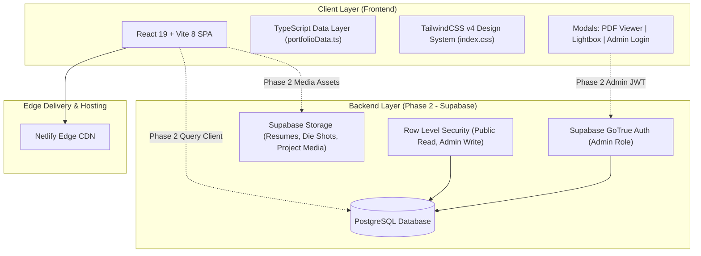

# Architecture Specification & Engineering Portfolio Blueprint
**Portfolio Owner:** VIJAYARAGAVAA V — Aspiring RTL Design & Verification Engineer  
**Core Disciplines:** Electronics & Communication Engineering, VLSI, RTL Design (Verilog HDL/SystemVerilog), FPGA, Digital Design, Verification, IoT, AI + Hardware Systems  

---

## 1. High-Level System Architecture



---

## 2. Directory Structure & Module Separation

The repository is decoupled into dedicated root folders to guarantee complete separation between the presentation tier and backend infrastructure:

```
c:\prot\
├── ARCHITECTURE.md              # Complete system design & execution roadmap
├── stitch_reference.html        # Original Stitch design system & visual prototype
├── backend/                     # Phase 2 Supabase migrations, schemas & edge functions
│   ├── README.md                # Backend architecture & Supabase onboarding guide
│   ├── schema.sql               # Planned PostgreSQL DDL schema & RLS policies
│   └── seed.sql                 # SQL seed data derived from portfolioData.ts
└── frontend/                    # Phase 1 React 19 + Vite + TailwindCSS v4 SPA
    ├── index.html               # Semantic HTML entry with JetBrains Mono + Space Grotesk
    ├── vite.config.ts           # Vite config with @tailwindcss/vite and @vitejs/plugin-react
    ├── package.json             # React 19, Lucide React icons, TailwindCSS v4
    ├── src/
    │   ├── main.tsx             # Application bootstrap
    │   ├── App.tsx              # View orchestrator, modal state management, sticky navigation
    │   ├── index.css            # Tailwind v4 theme tokens, semiconductor grid, cyan glow effects
    │   ├── types/
    │   │   └── portfolio.ts     # TypeScript interfaces for all 12 domains
    │   ├── data/
    │   │   └── portfolioData.ts # Strongly-typed content model for Vijayaragavaa V
    │   ├── assets/              # Profile portraits, silicon die shots, FPGA prototype imagery
    │   └── components/
    │       ├── Header.tsx       # Sticky glassmorphism header, mobile drawer, RTL resume quick CTA
    │       ├── Hero.tsx         # 3-column command center: bio, portrait, EDA toolchain telemetry
    │       ├── About.tsx        # Engineering philosophy, architectural tenets, technical profile
    │       ├── Skills.tsx       # 6-category matrix: RTL, FPGA, Verification, Protocols, Tools, IoT
    │       ├── Projects.tsx     # Hardware designs (PARKIFY, Voting Machine, Smart Lift)
    │       ├── Hackathons.tsx   # Hardware prototype showcase with telemetry metrics & architecture
    │       ├── Achievements.tsx # IEEE, national hackathon honors, university rank badges
    │       ├── Certifications.tsx # Industry credentials (IEEE, Xilinx, NPTEL) with modal triggers
    │       ├── Education.tsx    # Academic journey & coursework at RMK Engineering College
    │       ├── Experience.tsx   # Research lab & hardware engineering responsibilities
    │       ├── Gallery.tsx      # High-res hardware lab, FPGA boards, die shots + Lightbox modal
    │       ├── Contact.tsx      # Terminal-style contact form & direct social dispatch channels
    │       ├── Resume.tsx       # In-browser PDF Document Viewer modal + direct PDF download
    │       ├── Footer.tsx       # System telemetry, copyright, and subtle Admin Login trigger
    │       ├── DocumentViewer.tsx # Interactive modal PDF viewer for RTL Resume & certifications
    │       ├── ImageLightbox.tsx  # High-resolution modal lightbox for gallery inspection
    │       ├── AdminLoginModal.tsx# Secure login portal (Phase 1 preview / Phase 2 Auth)
    │       └── SectionHeader.tsx  # Reusable semiconductor-themed section header
```

---

## 3. Visual Design System Specification

| Token / Element | Value / Rule | Description |
| :--- | :--- | :--- |
| **Primary Background** | `#030609` | Deep space black / obsidian vacuum |
| **Card Surface** | `#07111f` | Dark silicon slate with subtle cyan boundary lines |
| **Card Border** | `#10304d` | Subdued circuit trace border |
| **Primary Accent** | `#00d9ff` | Electric Cyan (glows, badges, buttons, active states) |
| **Secondary Accent** | `#a78bfa` | Electric Violet (verification & academic markers) |
| **Success / Valid** | `#34d399` | Hardware green (timing closure, simulation passed) |
| **Warning / Alert** | `#fbbf24` | Amber (critical clocks, synthesis constraints) |
| **Body Typography** | `Space Grotesk` | Modern, clean, geometric sans-serif for readability |
| **Tech / Code Typography** | `JetBrains Mono` | High-precision monospace for telemetry, addresses, registers |
| **Grid Overlay** | `.tech-grid` | 32px x 32px subtle semiconductor circuit grid pattern |

---

## 4. Phase 1 vs. Phase 2 Execution Plan

### Phase 1: Standalone Frontend Website (COMPLETED & VERIFIED)
- [x] Full UI match against Google Stitch reference design.
- [x] All 12 required portfolio sections implemented with authentic engineering data.
- [x] Interactive modals:
  - Document Viewer (PDF Resume modal).
  - Image Lightbox (Lab & FPGA board gallery inspection).
  - Admin Login modal stub with clear Phase 2 connectivity indicators.
- [x] Zero build errors with `tsc -b && vite build` (Verified).
- [x] Live Vite dev server running on `http://localhost:5173/`.

### Phase 2: Full-Stack Integration & CMS (UPCOMING)
1. **Supabase Database Setup:**
   - Deploy PostgreSQL database with tables: `projects`, `skills`, `achievements`, `certifications`, `gallery_items`, `contact_messages`.
   - Implement Row Level Security (RLS): Public can `SELECT`, authenticated admin can `INSERT`, `UPDATE`, `DELETE`.
2. **Supabase Storage:**
   - Bucket `portfolio-media`: Images, die shots, schematics, resumes.
3. **Admin CMS Dashboard:**
   - Authenticated route `/admin` with edit/add/delete forms for projects, metrics, and resume uploads.
4. **CI/CD & Deployment:**
   - Push to GitHub repository.
   - Continuous deployment on Netlify with custom domain and SSL.
